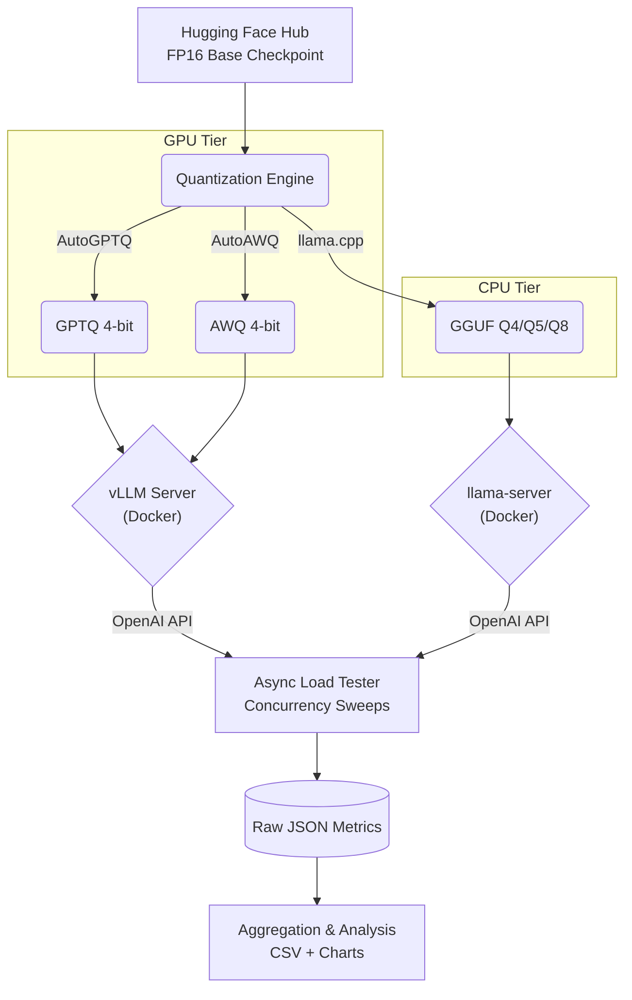

# 🚀 On-Premise LLM Serving & Quantization Benchmark

[](https://github.com/abntazim-1/On-Premise-LLM-Service-and-Quantization-Benchmark/actions/workflows/smoke-test.yml)
[](https://www.python.org/downloads/release/python-3100/)
[](https://github.com/vllm-project/vllm)
[](https://github.com/ggerganov/llama.cpp)

An enterprise-grade, reproducible benchmarking suite designed to evaluate the throughput, latency, memory footprint, and quality trade-offs of running open-source Large Language Models (LLMs) on-premise. 

This framework takes a base model (e.g., `Llama-2-7b-hf`) and explicitly quantizes it across the industry's leading formats (**GPTQ**, **AWQ**, and **GGUF**). It then serves these variants using Dockerized **vLLM** (for GPU acceleration) and **llama.cpp** (for CPU inference) behind standardized OpenAI-compatible APIs to perform apples-to-apples load testing.

---

## 📑 Table of Contents
- [Architecture](#-architecture)
- [Key Features](#-key-features)
- [Quick Results Snapshot](#-quick-results-snapshot)
- [System Prerequisites](#-system-prerequisites)
- [Quick Start / Runbook](#-quick-start--runbook)
- [Design Decisions](#-design-decisions)

---

## 🏗️ Architecture

The pipeline is entirely decoupled, passing strict configuration definitions (`configs/*.yaml`) between independent stages. 



---

## ✨ Key Features
- **Reproducible Environment**: Pinned dependencies and a central `Makefile` ensure identical runs across environments.
- **Unified API Contract**: Both CPU and GPU runtimes are wrapped in OpenAI-compatible endpoints, eliminating client-side branching logic.
- **Asynchronous Load Testing**: Async client sweeps concurrency levels (`1→32`) capturing real-time P50/P95/P99 latency, Token Throughput, and TTFT (Time To First Token).
- **Quality Guardrails**: Built-in automated Perplexity calculation (Wikitext-2) ensures quantization doesn't silently destroy model intelligence.
- **Immutable Artifacts**: Every run generates timestamped JSON artifacts. Aggregation scripts automatically weave these into actionable charts.

---

## 📊 Quick Results Snapshot

*(Note: Run `make bench-all` to generate metrics specific to your hardware profile)*

| Variant | Precision | Runtime | Concurrency | P50 Latency (ms) | Throughput (tok/s) | Peak VRAM |
|---------|-----------|---------|-------------|------------------|--------------------|-----------|
| **Base**| FP16      | vLLM    | 16          | *evaluating...*  | *evaluating...*    | *evaluating...*|
| **GPTQ**| 4-bit     | vLLM    | 16          | *evaluating...*  | *evaluating...*    | *evaluating...*|
| **AWQ** | 4-bit     | vLLM    | 16          | *evaluating...*  | *evaluating...*    | *evaluating...*|
| **GGUF**| Q4_K_M    | llama   | 16          | *evaluating...*  | *evaluating...*    | CPU RAM   |

**Recommendation Matrix:**
* **GPU-Rich Infrastructure**: AWQ via vLLM (optimal token throughput, low latency).
* **Edge / CPU-Bound**: GGUF Q5_K_M via llama.cpp (balances memory constraints with near-FP16 reasoning).

---

## 💻 System Prerequisites
- **OS**: Linux / WSL2
- **Compute**: NVIDIA GPU (16GB+ VRAM) for GPTQ/AWQ & vLLM serving. CPU-only execution is supported strictly for GGUF pipelines.
- **Memory**: 32GB System RAM.
- **Dependencies**: Python 3.10+, Docker, `make`.

---

## 🛠️ Quick Start / Runbook

### 1. Initialization
Clone the repository and set up the locked environment:
```bash
git clone https://github.com/abntazim-1/On-Premise-LLM-Service-and-Quantization-Benchmark.git
cd On-Premise-LLM-Service-and-Quantization-Benchmark
python -m venv venv && source venv/bin/activate
make install
```

### 2. Prepare Base Weights
```bash
make download
```

### 3. Execution (Quantization)
*Note: GGUF quantization uses CPU. GPTQ/AWQ require GPU.*
```bash
make quantize-gguf
make quantize-gptq
make quantize-awq
```

### 4. Serving & Load Testing
Spin up a runtime server in Terminal A, then bombard it with the async client in Terminal B.

**Terminal A (Start Server):**
```bash
# Example: Serve GPTQ via vLLM
./scripts/05_serve_vllm.sh gptq 8000
```
**Terminal B (Run Test):**
```bash
python scripts/07_loadtest.py --variant gptq --runtime vllm
```

### 5. Evaluation & Aggregation
Calculate perplexity scores and aggregate all raw JSON telemetry into charts and CSVs.
```bash
python scripts/08_eval_quality.py --variant gptq
make aggregate
```
*Results will be published to `results/aggregated/results.csv` and visual plots to `results/charts/`.*

---

## 📐 Design Decisions

1. **Cost-Aware Compute Split**: The pipeline intelligently isolates CPU-bound operations (GGUF) from GPU-bound operations (GPTQ/AWQ). This allows platform teams to run heavy GGUF pipelines on cheap local hardware while reserving expensive rented cloud instances (e.g., RunPod) strictly for calibration.
2. **Streaming Telemetry**: The load tester utilizes `stream: True` natively against the APIs. This guarantees accurate Time-To-First-Token (TTFT) measurements regardless of the total payload size.
